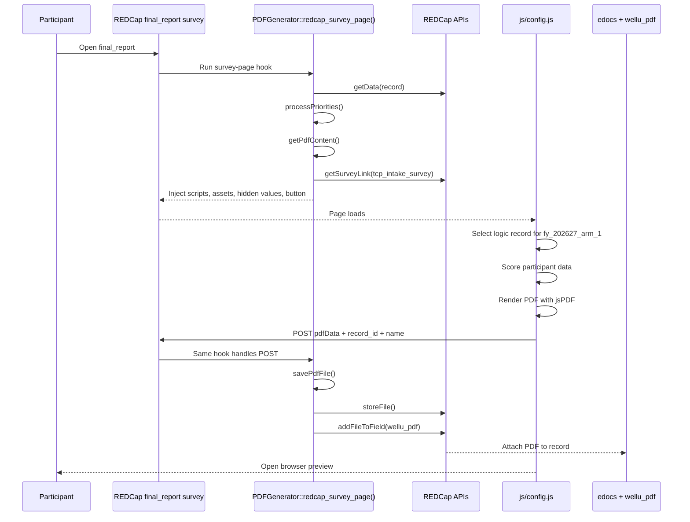
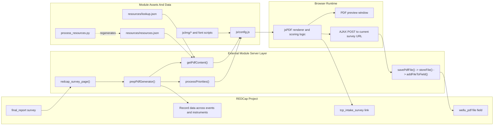

# Engineer Onboarding

This module is a WellU HRA-specific REDCap External Module. It generates a participant-facing PDF on the `final_report` survey, saves that PDF into REDCap edocs, and attaches it to the `wellu_pdf` file field on the record.

The code is split across one PHP orchestrator, one large browser-side PDF renderer, and JSON resource files that drive the detailed action-plan content. If you are handing this off for priority updates, SDOH work, or resource refreshes, start here before changing code.

## Key Files

- [`config.json`](../config.json): External Module metadata and settings.
- [`PDFGenerator.php`](../PDFGenerator.php): REDCap hook entry point, record loading, priority processing, resource lookup, and PDF save flow.
- [`js/config.js`](../js/config.js): jsPDF rendering, client-side record selection, scoring, layout, preview, and POST back to PHP.
- [`resources/lookup.json`](../resources/lookup.json): category prefixes and section labels for the lower half of the PDF.
- [`resources/resources.json`](../resources/resources.json): detailed resource copy keyed by `<prefix>_<choice>`.
- [`process_resources.py`](../process_resources.py): spreadsheet-to-JSON exporter for `resources/resources.json`.
- [`generated_pdfs/README.md`](../generated_pdfs/README.md): temp directory requirement for server-side PDF saving.
- [`pages/pdfgenerator.php`](../pages/pdfgenerator.php): legacy test page; not part of the normal survey runtime.

## Runtime Flow In REDCap

When a participant opens the `final_report` survey, the External Module injects the PDF assets and data payload, the browser builds the PDF with jsPDF, and the browser POSTs the generated file back to the same survey page so PHP can save it to the record.

### Step-by-step

1. [`PDFGenerator.php`](../PDFGenerator.php) `redcap_survey_page()` only runs the PDF setup path when the current instrument is `final_report`.
2. `prepPdfGenerator()` loads the full record payload, builds the top-priority tiles, builds the detailed resource payload, resolves the tailored care survey link, and injects JS libraries plus serialized data into the survey page.
3. `processPriorities()` reads the hard-coded `$lookup` map and uses priority, top-three, and ranking fields to decide which four tiles appear at the top of the PDF.
4. `getPdfContent()` reads [`resources/lookup.json`](../resources/lookup.json) and [`resources/resources.json`](../resources/resources.json), then maps REDCap fields like `<prefix>_action`, `<prefix>_yn`, and `<prefix>_is_green` to the detailed resource sections shown later in the PDF.
5. [`js/config.js`](../js/config.js) receives the server payload, filters down to one "logic record", calculates summary metrics and risk colors, renders the PDF, opens a preview window, and POSTs the PDF back to PHP. Both auto-generation on page load and the manual "Download Your Results" button use this same `PDF.generatePDF()` path.
6. The POST lands on the same survey page. PHP decodes the base64 PDF, writes a temp file into `generated_pdfs/`, stores it as an edoc, attaches the edoc to `wellu_pdf`, and deletes the temp file.

## Architecture Map

## What Each Layer Owns

| Layer | Owns | Notes |
| --- | --- | --- |
| [`PDFGenerator.php`](../PDFGenerator.php) | REDCap hook entry, record fetch, priority selection, resource selection, file save flow | This is the only server-side runtime file that matters for the live survey flow. |
| [`js/config.js`](../js/config.js) | PDF layout, summary scoring, tailored care eligibility, browser preview, POST back to PHP | This file mixes rendering and business logic, so many changes touch both data and layout here. |
| [`resources/lookup.json`](../resources/lookup.json) | category prefixes and lower-section labels | Prefixes here drive how `getPdfContent()` constructs field names. |
| [`resources/resources.json`](../resources/resources.json) | resource copy, links, tile subtext, detailed section paragraphs/bullets | Keys must match the `<prefix>_<choice>` pattern expected by `getPdfContent()`. |
| [`process_resources.py`](../process_resources.py) | optional spreadsheet export path | Only matters if the team still edits resource content in a spreadsheet source of truth. |
| `generated_pdfs/` | temp file staging before edocs save | Must be writable by the web process. |
| [`pages/pdfgenerator.php`](../pages/pdfgenerator.php) | legacy test harness | Not part of normal runtime; safe to ignore unless reviving test tooling. |

## Data Contracts That Matter

These assumptions are hard-coded today:

- Survey instrument: `final_report`
- Tailored care survey instrument: `tcp_intake_survey`
- Tailored care event: `fy_202627_arm_1`
- Output file field: `wellu_pdf`
- Participant name fields: `first_name`, `last_name`
- Priority mapping source: private `$lookup` array in [`PDFGenerator.php`](../PDFGenerator.php)
- Resource-state field family: `<prefix>_action`, `<prefix>_yn`, `<prefix>_is_green`

Two implementation details are easy to miss:

- PHP usually reads priority and resource data from `$record[1]`, which assumes the relevant event/instrument data is at array index `1`.
- JS chooses its working record by filtering for `redcap_event_name === "fy_202627_arm_1"`, `redcap_repeat_instrument === ""`, and `affirmative === "1"`.

If the project event structure changes, PHP and JS can drift because they do not identify the source record the same way.

## Data-Shaping Cheatsheet

### Top-of-PDF priorities

`processPriorities()` uses the `$lookup` array in [`PDFGenerator.php`](../PDFGenerator.php). Each entry defines:

- `priority_field`: the OCIH priority score source
- `top_three_field`: whether the goal is in the participant's top three
- `ranking_field`: participant-selected ranking order
- `image`: the icon filename used by [`js/config.js`](../js/config.js)
- `lookup_content`: the detailed resource section that the tile links to

In practice, this means the top tile bar is not just cosmetic. Changing a priority label or grouping usually also changes the detailed section that appears later in the PDF.
The browser render currently assumes exactly four top tiles, so any change to that count also requires layout work in [`js/config.js`](../js/config.js).

### Lower PDF resource sections

`getPdfContent()` builds each section in three steps:

1. Read a prefix from [`resources/lookup.json`](../resources/lookup.json), such as `activity`, `stress`, or `phq`.
2. Build REDCap field names from that prefix: `<prefix>_action`, `<prefix>_yn`, and `<prefix>_is_green`.
3. Resolve a resource key in [`resources/resources.json`](../resources/resources.json) using `<prefix>_<choice>`, then add the section label from `lookup.json`.

That lookup contract is why content changes are usually data-only, while new categories or new field patterns usually require PHP changes too.

### Summary metrics and risk colors

[`js/config.js`](../js/config.js) calculates the front-page summary data entirely in the browser:

- `calculateIndividualData()`: summary table values
- `calculateRiskKeyBubbles()`: risk colors for the metric bubbles
- `calculateRiskKeysTable()`: risk colors for the summary table rows
- `calculateA1CValue()`: display value for the A1C bubble
- `qualifiedTCP` logic inside `PDF.generatePDF()`: tailored care callout

If SDOH scoring is added to the PDF, this is the layer that will likely need the new scoring and display logic.

## Where Upcoming Work Lands

| Workstream | Primary touchpoints | Why |
| --- | --- | --- |
| Priority ranking updates | [`PDFGenerator.php`](../PDFGenerator.php) `$lookup`, `processPriorities()`; [`js/config.js`](../js/config.js) top-tile render loop; [`resources/lookup.json`](../resources/lookup.json); [`resources/resources.json`](../resources/resources.json); icon assets in `js/img/` | Priority changes affect tile selection, tile labels/images, and which detailed sections the icons link to. |
| SDOH scoring and SDOH resource presentation | [`PDFGenerator.php`](../PDFGenerator.php) `getCurrentRecordData()`, `prepPdfGenerator()`, `getPdfContent()`; [`js/config.js`](../js/config.js) scoring helpers, `PDF.generatePDF()`, lower-section rendering; [`resources/lookup.json`](../resources/lookup.json); [`resources/resources.json`](../resources/resources.json); [`process_resources.py`](../process_resources.py) if spreadsheet-driven | SDOH adds both new data inputs and new rendered content, so it crosses PHP, JS, and resource JSON boundaries. |
| Resource refresh for existing categories | [`resources/resources.json`](../resources/resources.json), optionally [`resources/lookup.json`](../resources/lookup.json), and the REDCap choice codes that feed `<prefix>_action` | Existing categories can often be updated without code changes as long as the JSON keys still match the REDCap values. |

## Recommended Approach For The Next Engineers

1. Confirm the REDCap field contract first, especially any new priority, SDOH, or resource choice values.
2. Trace whether the needed data already exists in the record payload returned by `getData()`.
3. Update the PHP data-shaping layer before changing layout, so the browser receives a stable payload.
4. Update [`js/config.js`](../js/config.js) once the payload shape is settled.
5. Update resource JSON last unless the change is content-only.
6. Run an end-to-end manual test on representative records after every behavior change.

## Biggest Risks

- PHP and JS select their source data differently, so event changes can silently break the PDF.
- The save flow trusts browser-posted `record_id` and `name`.
- The tailored care event name is hard-coded to one fiscal-year event.
- [`js/config.js`](../js/config.js) mixes business rules, scoring, and layout in one file.
- The spreadsheet source used by [`process_resources.py`](../process_resources.py) is not present in this repo.
- `pdf_generator_log.txt` can grow very large during development.

## See Also

- [`maintenance.md`](./maintenance.md): change strategy, smoke tests, and near-term backlog
- [`README.md`](../README.md): setup and general module notes
